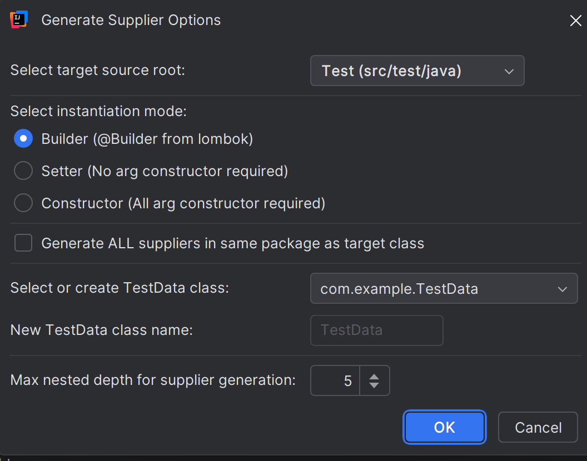

# Test-Data-Builder-plugin
An IntelliJ IDEA plugin that generates supplier-based test data builders for Java classes using the Test Data Builder pattern.

## Java class -> [Ctrl+Shift+S]


```java

@Builder
public class D12 {
    String clientIban;
    Map<URL, UUID> data;
    LocalDate localDate;
    Instant instant;
    TestEnum enumValue;
}

public class D12Supplier implements Supplier<D12> {

    private String clientIban;
    private Map<URL, UUID> data;
    private LocalDate localDate;
    private Instant instant;
    private TestEnum enumValue;

    public static D12SupplierBuilder configuredBuilder() {
        return D12Supplier.builder()
                .clientIban("DE00500105175565620059")
                .data(createPredefinedMap_java_util_Map_java_net_URL_java_util_UUID())
                .localDate(LocalDate.of(2025, 8, 3))
                .instant(Instant.parse("2025-08-03T20:29:11.014575100Z"))
                .enumValue(TestEnum.ENUM_3);
    }

    private static Map<URL, UUID> createPredefinedMap_java_util_Map_java_net_URL_java_util_UUID() {

        Map<URL, UUID> supportMethodResult = new HashMap<>();
        supportMethodResult.put(createUrl("https://testdata.com"), UUID.fromString("fede7d1f-63aa-4bce-a3d0-4d0fd0161ab4"));
        supportMethodResult.put(createUrl("https://testdata.com"), UUID.fromString("c301dbe0-eee7-4ca6-91a6-2716988a493a"));
        supportMethodResult.put(createUrl("https://testdata.com"), UUID.fromString("e9fb1435-3cf9-44db-ac8f-8af2a2728f6b"));
        return supportMethodResult;
    }
    
    private static URL createUrl(String url) {
        try {
            return new URI(url).toURL();
        } catch (MalformedURLException e) {
            throw new RuntimeException(e);
        } catch (URISyntaxException e) {
            throw new RuntimeException(e);
        }
    }
        public static D12 initialized() {
        return configuredBuilder().build().get();
    }

    public static D12 initialized() {
        return configuredBuilder().build().get();
    }

    @Override
    public D12 get() {
        return D12.builder()
                .clientIban(clientIban)
                .data(data)
                .localDate(localDate)
                .instant(instant)
                .enumValue(enumValue)
                .build();
    }

